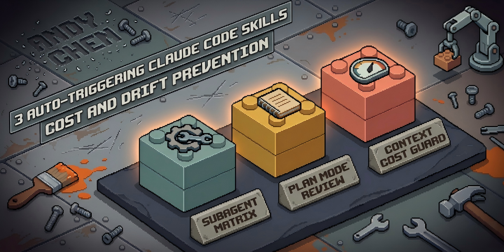

<p align="right">
  <a href="./README.md">English</a> ·
  <b>中文</b>
</p>

<p align="center">
  
</p>

# claude-code-survival-kit

> **没装这三个，别急着上线。**
>
> 6 个月真实 Claude Code 使用里提炼出的三个旗舰 skill。
> 不是编码原则，不是 spec-driven 工作流，就是生存工具箱。

[](./LICENSE)
[](https://code.claude.com)
[](#roadmap)

---

## 为什么存在

一次 2 小时的 Claude Code 会话。96 次 `opus` 调用。上下文峰值：**365K tokens**。账单：**$115+**。

那只是一次会话。我跑过很多次。

6 个月追踪 token 实际流向和规划漂移位置后,我提炼出三条具体规则。凭 cache-hit 数学和子 agent 成本隔离，它们**在类似会话上砍掉 ~80% 成本**。

本仓库把这三条规则打包成自动触发的 Claude Code skill。安装 10 秒，零配置。

---

## 和其他仓库的区别

不是又一个"最佳实践"合集。Claude Code 生态已经有优秀的了。挑你的赛道：

| 仓库 | 教什么 | 我们不做 |
|---|---|---|
| [`karpathy-skills`](https://github.com/forrestchang/andrej-karpathy-skills) | 编码原则（Think Before Coding、Simplicity First...） | 不教*怎么写代码* |
| [`cc-sdd`](https://github.com/gotalab/cc-sdd) | Spec-driven 开发流水线（17 skills，Kiro 风格） | 不管你的开发管道 |
| [`best-practice`](https://github.com/shanraisshan/claude-code-best-practice) | 综合教程站、视频、指南 | 不重复他们的广度 |
| **`claude-code-survival-kit`** | **成本模型 / 漂移防范 / 元方法论** | |

互补，不竞争。

**垂直定位**：围绕你代码发生的一切——不是代码本身。怎么选子 agent 的 model/effort 才不会下午就烧掉 $100。怎么避免带着误诊断的问题进 Plan Mode。怎么理解你 3 小时会话为什么比上次贵 10 倍。

---

## 安装

**前置**：Claude Code 已安装（支持 plugin 的版本）。

```bash
# 第 1 步：加 marketplace
/plugin marketplace add Rubbish0-A/claude-code-survival-kit

# 第 2 步：装 plugin
/plugin install survival-kit@claude-code-survival-kit
```

就这样。三个 skill 在相关场景自动触发，零配置。

验证：
```bash
/plugin list
# 应该看到：survival-kit (enabled)
```

---

## 三条规则

每个 skill 是一份自动触发的 Markdown 文件。你不用手动调用——Claude Code 根据 description 匹配你当前任务自动加载。

### 1. `subagent-matrix` — 别再默认 `opus + max`

**你会看到的症状**：每个子 agent 都 `opus + xhigh` 启动，账单飞涨。大部分调用**本该**是 `sonnet + high` 或 `haiku + low`。

**它做什么**：按任务类型给出具体的 model × effort 选择矩阵（纯检索 → haiku+low，常规编码 → sonnet+high，架构/安全 → opus+max）。包括 **tripwire 原则**（从 xhigh 起步，仅在观察到失败后升 max，禁止预防性升级）、禁忌组合（`haiku × max` 永远浪费）、以及**降 model 比降 effort 省 3-5 倍成本**这个数学事实。

**触发场景**：主会话即将派子 agent 时，或你问"X 任务用什么 model"时。

[→ 查看 SKILL.md](./plugins/survival-kit/skills/subagent-matrix/SKILL.md)

---

### 2. `plan-mode-review` — 别给误诊断的问题做规划

**你会看到的症状**：一段 20 分钟的规划会话以"等等，其实问题不是 X 是 Y"结尾。时间、cache、耐心全浪费。

**它做什么**：进入 Plan Mode 之前强制**三层输入审查**：

1. **问题成立吗？** — 验证用户的归因和前提。正常行为经常被当 bug 报。
2. **信息够吗？** — 缺口标 `P0 必须有` / `P1 最好有` / `P2 锦上添花`。`P0` 缺口不补齐不带假设往下走。
3. **有隐藏问题吗？** — 症状之下是否藏着用户没看见的更深 root cause？

外加每个规划假设的 `Confident / Likely / Unclear` 置信标签、硬性 3 轮修订上限、迭代时显式标注*删除 / 降级 / 延后*。

**触发场景**：「架构」「设计」「重构」「迁移」「新功能」「怎么做」或跨多文件的改动请求。单文件小改不触发。

[→ 查看 SKILL.md](./plugins/survival-kit/skills/plan-mode-review/SKILL.md)

---

### 3. `context-cost-guard` — 搞懂会话为什么变贵

**你会看到的症状**：「只聊了 3 小时怎么账单 $150？」或者「走开 30 分钟，下一条消息贵了 10 倍」。

**它做什么**：把 4 源 token 累积模型说清楚：

1. **系统提示**（~11K，首轮固定）
2. **对话历史**（线性增长——不自动回收）
3. **工具结果**（块状增长——`Read` 700 行 = ~8K，全留着）
4. **Skill 触发**（一次性 ~4K 每个 skill）

外加成本公式：`cache_read × 已有上下文 + cache_creation × 本轮新增 + input + output`。为什么 `cache_read` **不免费**（300K 上下文下按 $1.50/M 每轮还是要付钱）。为什么 **5 分钟 cache TTL** 解释了"走开一会再聊突然变贵"这个问题。200K/300K/400K 的 compact 阈值。4 种避免手段（子 agent 外包、Grep+offset 代替全文 Read、Plan Mode 自动清理、任务分段）。

**触发场景**：「为啥这么贵」「该 compact 吗」「上下文太大了」或观察到上下文快速膨胀时。

[→ 查看 SKILL.md](./plugins/survival-kit/skills/context-cost-guard/SKILL.md)

---

## 证据

<a id="evidence"></a>

锚点会话：**2 小时，96 次 `opus` 调用，上下文峰值 365K，账单 $115+**。这就是逼出规则 #3 成本模型的那次会话。

应用这些规则后的收益（对应各自机制）：

| 杠杆 | 机制 | 收益 |
|---|---|---|
| `subagent-matrix` 降级路径 | Model 降级 ≈ 单次调用成本 3-5× 削减；大部分子 agent 不该用 opus | 子 agent 成本 40-60% |
| `context-cost-guard` 4 源意识 | 子 agent 外包 + Grep+offset + 分段会话 | 主会话上下文 20-30% |
| `plan-mode-review` 三层审查 | 在规划开始前拦截 ~30% 误诊断问题 | 消除返工循环 |

$115 锚点是真实追踪会话。重点不是卖数字——是给你心智模型，让你自己算自己的账。

> 📏 **关于截图**：故意不放 before/after 账单图。单次会话方差太大，任何这类图都等于 cherry-pick；数学自己证明就够。

---

## Roadmap

<a id="roadmap"></a>

**v1.0（本次发布）**：3 个旗舰自动触发 skill。足够堵住前 3 大成本/漂移泄漏。

**v1.1（即将）**：5 份额外的手动 copy rule 和 reference doc：

- `methodology-vs-tool` — 什么时候**不**装 plugin；三路径评估（装 / 不装 / 抽方法论）
- `tool-minimalism` — 为什么"要不要加 X"的门槛应该**随时间递增**而非递减
- `auto-vs-manual-triggering` — 哪些自动化该放 rules、哪些该留给用户主动喊
- `skill-as-loader-pattern` — 什么时候 SKILL.md 该做 3KB 索引而非 30KB 正文
- `verify-before-deny` — rules 为什么滞后于客户端更新，怎么让 assistant 保持诚实

Watch 这个仓库（★ + Watch → Releases only）接收 v1.1 发布通知。

---

## FAQ

**Q：为什么只有 3 个 skill？别的仓库都 20+。**

> 因为 3 就是自动触发 skill 的正确数量。每个常驻 skill 都消耗每次会话的系统提示 token。堆 skill 充数正是这些规则要纠正的行为。`skill-as-loader-pattern`（v1.1）会深入这点——简短版：你 plugin 的 token 成本是你发给用户的一个 feature，不免费。

**Q：给单人开发者还是团队？**

> 单人开发者和个人贡献者。这里所有内容关乎你自己 Claude Code 会话的成本和质量。团队级 agent 编排不是本赛道。

**Q：会和 `cc-sdd` / `karpathy-skills` / 别的已装 skill 冲突吗？**

> 不会。这 3 个 skill 触发在正交关键词上（子 agent 派发 / plan mode / context cost）。和任何东西并行装都行。

**Q：`~80%` 省成本说法站得住吗？**

> 数学在上面的 [证据](#evidence) 段里。如果你的子 agent 已经大部分是 `sonnet+high`、会话不超过 200K、规划从不误诊断——你已经过了典型泄漏点，这些规则帮不上你多少。

**Q：怎么贡献新规则？**

> 开 issue，包含：(1) 症状 (2) 机制 (3) 至少一个真实事故证明这条规则能省时间/钱。没有事故数据的规则会被关闭——"要是能这样就好了"正是这类仓库膨胀成噪音的原因。

---

## 致谢与前辈作品

本仓库构建于——并明确不重叠——以下工作：

- `karpathy-skills` 的编码原则
- `cc-sdd` 的 spec-driven 工作流
- `best-practice` 的教程深度
- Claude Code 原生 `Plan Mode` 和 `Skill` 系统（这些规则建在它们之上，不是绕开它们）

数字和阈值（200K/300K/400K）引用社区工作——特别是 Thariq 2026 年 4 月关于 context rot 的分析。

---

## License

MIT。详见 [LICENSE](./LICENSE)。

Notes from the field 出自亲历实践，与 Anthropic 无官方关联。
